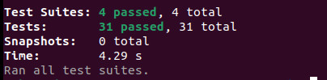
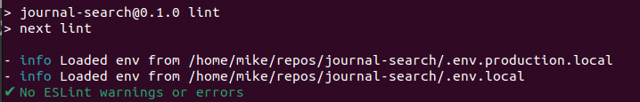

Link: https://journal-search.vercel.app/

I'm proud to introduce Harry Howard's Journals, an advanced web application that redefines the way we explore historical journal entries. Using Next.js, Python, and AI tools, the app processes and analyzes my great grandfather's journal entries from the 1930s and 40s. These entries are enhanced by AI and made easily accessible, putting a treasure trove of historical data at your fingertips.

All tests passing

No ESLint warnings or errors

